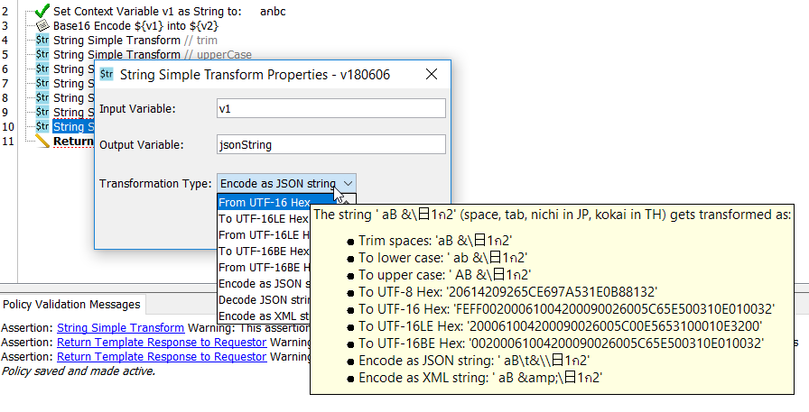

# String Simple Transform Custom Assertion

This assertion allows simple transformation such as:
* trim spaces
* to upper case and lower case
* encore and decode hexadecimal strings in UTF-8 and UTF-16 character sets
* encode and decode JSON and XML 1.0 and 1.1 strings

It has been designed to support easy addition of a new type transformation without the need of the Custom Assertion SDK. The ['transforms' package](https://github.com/guyplusplus/String-Simple-Transform-Custom-Assertion/tree/master/src/main/java/community/layer7/customassertion/stringSimpleTransform/tranforms) is independent and can be compiled without the SDK.

At the core, the [StringTransformer.java](https://github.com/guyplusplus/String-Simple-Transform-Custom-Assertion/blob/master/src/main/java/community/layer7/customassertion/stringSimpleTransform/tranforms/StringTransformer.java) class itself contains most of the actual transfornation code. It can be compiled without the SDK. Just need to replace the generated .class file(s) in the jar file.